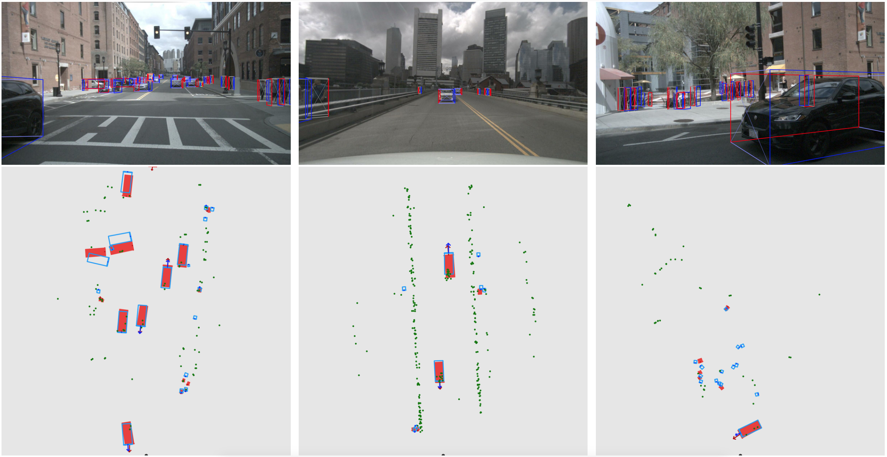

# CenterFusion <!-- omit in toc --> 
 This repository contains the implementation of [CenterFusion: Center-based Radar and Camera Fusion for 3D Object Detection](https://arxiv.org/abs/2011.04841).


### Citing CenterFusion <!-- omit in toc -->
 If you find CenterFusion useful in your research, please consider citing:

> **[CenterFusion: Center-based Radar and Camera Fusion for 3D Object Detection](https://arxiv.org/abs/2011.04841)** \
> Ramin Nabati, Hairong Qi

    @article{nabati2020centerfusion,
      title={CenterFusion: Center-based Radar and Camera Fusion for 3D Object Detection},
      author={Nabati, Ramin and Qi, Hairong},
      journal={arXiv preprint arXiv:2011.04841},
      year={2020}
    }


----------------------------------------
## Contents <!-- omit in toc --> 
- [Introduction](#introduction)
- [Results](#results)
- [Installation](#installation)
- [Dataset Preparation](#dataset-preparation)
- [Pretrained Models](#pretrained-models)
- [Training](#training)
- [Testing](#testing)
- [References](#references)
- [License](#license)

## Introduction
We focus on the problem of radar and camera sensor fusion and propose a middle-fusion approach to exploit both radar and camera data for 3D object detection. Our method, called CenterFusion, first uses a center point detection network to detect objects by identifying their center points on the image. It then solves the key data association problem using a novel frustum-based method to associate the radar detections to their corresponding object's center point. The associated radar detections are used to generate radar-based feature maps to complement the image features, and regress to object properties such as depth, rotation and velocity. We evaluate CenterFusion on the challenging nuScenes dataset, where it improves the overall nuScenes Detection Score (NDS) of the state-of-the-art camera-based algorithm by more than 12%. We further show that CenterFusion significantly improves the velocity estimation accuracy without using any additional temporal information.

## Results
- #### Overall results: <!-- omit in toc --> 

  | Dataset      |  NDS | mAP | mATE | mASE | mAOE | mAVE | mAAE |
  |--------------|------|------|------|------|------|------|------|
  |nuScenes Test | 0.449|0.326 |0.631 |0.261 |0.516 |0.614 |0.115 |
  |nuScenes Val  | 0.453|0.332 |0.649 |0.263 |0.535 |0.540 |0.142 |

- #### Per-class mAP: <!-- omit in toc --> 
  
  |  Dataset    |  Car | Truck | Bus | Trailer | Const. | Pedest. | Motor. | Bicycle | Traff. | Barrier |
  |-------------|------|-------|-----|---------|--------|---------|--------|---------|--------|---------|
  |nuScenes Test|0.509 |0.258  |0.234| 0.235   |0.077   |0.370    |0.314   |0.201    |0.575   | 0.484   |
  |nuScenes Val |0.524 |0.265  |0.362| 0.154   |0.055   |0.389    |0.305   |0.229    |0.563   | 0.470   |

- #### Qualitative results: <!-- omit in toc --> 

<p align="center">  </p> 


## Installation

The code has been tested on Ubuntu 16.04 and CentOS 7 with Python 3.7, CUDA 10.0 and PyTorch 1.2. For installation, follow these steps:

1. Create a new virtual environment (optional):
    ```bash
    mkvirtualenv centerfusion  
    ```

2. Install [PyTorch](https://pytorch.org/get-started/locally/):
    ```bash
    pip install torch torchvision
    ```

3. Install [COCOAPI](https://github.com/cocodataset/coco):
    ```bash
    pip install cython; pip install -U 'git+https://github.com/cocodataset/cocoapi.git#subdirectory=PythonAPI'
    ```

4. Clone the CenterFusion repository with the `--recursive` option. We'll call the directory that you cloned CenterFusion into `CF_ROOT`:
    ```bash
    CF_ROOT=/path/to/CenterFusion
    git clone --recursive https://github.com/mrnabati/CenterFusion.git $CF_ROOT
    ```

5. Install the requirements:
   ```bash
   cd $CF_ROOT
   pip install -r requirements.txt
   ```

6. Build the deformable convolution library:
    ```bash
    cd $CF_ROOT/src/lib/model/networks/DCNv2
    ./make.sh
    ```
    **Note:** If the DCNv2 folder does not exist in the `networks` directory, it can be downloaded using this command:
    ```bash
    cd $CF_ROOT/src/lib/model/networks
    git clone https://github.com/CharlesShang/DCNv2/
    ```

## Dataset Preparation

1. Download the nuScenes dataset from [nuScenes website](https://www.nuscenes.org/download).


2. Extract the downloaded files in the `${CF_ROOT}\data\nuscenes` directory. You should have the following directory structure after extraction:

    ~~~
    ${CF_ROOT}
    `-- data
        `-- nuscenes
            |-- maps
            |-- samples
            |   |-- CAM_BACK
            |   |   | -- xxx.jpg
            |   |   ` -- ...
            |   |-- CAM_BACK_LEFT
            |   |-- CAM_BACK_RIGHT
            |   |-- CAM_FRONT
            |   |-- CAM_FRONT_LEFT
            |   |-- CAM_FRONT_RIGHT
            |   |-- RADAR_BACK_LEFT
            |   |   | -- xxx.pcd
            |   |   ` -- ...
            |   |-- RADAR_BACK_RIGHT
            |   |-- RADAR_FRON
            |   |-- RADAR_FRONT_LEFT
            |   `-- RADAR_FRONT_RIGHT
            |-- sweeps
            |-- v1.0-mini
            |-- v1.0-test
            `-- v1.0-trainval
    ~~~
   

3. Run the `convert_nuScenes.py` script to convet the nuScenes dataset to COCO format:
    ```bash
    cd $CF_ROOT/src/tools
    python convert_nuScenes.py
    ```

## Pretrained Models
The pre-trained CenterFusion model and the baseline CenterNet model can be downloaded from the links below:
  | model       | epochs  | GPUs  | Backbone | Val NDS | Val mAP | Test  NDS   | Test mAP |
  |-------------|---------|-------|-----|-----|------|--------|-----------|
  | [centerfusion_e60](https://drive.google.com/uc?export=download&id=1XaYx7JJJmQ6TBjCJJster-Z7ERyqu4Ig) | 60 |  2x Nvidia Quadro P5000 | DLA | 0.453 | 0.332 | 0.449 | 0.326 |
  | [centernet_baseline_e170](https://drive.google.com/uc?export=download&id=1iFF7a5oueFfB5GnUoHFDnntFdTst-bVI) | 170 |  2x Nvidia Quadro P5000 | DLA | 0.328 | 0.306 | - | - |
  **Notes:**
  - The *centernet_baseline_e170* model is obtained by starting from the original CenterNet 3D detection model ([nuScenes_3Ddetection_e140](https://github.com/xingyizhou/CenterTrack/blob/master/readme/MODEL_ZOO.md)) and training the velocity and attributes heads for 30 epochs. 

## Training
The `$CF_ROOT/experiments/train.sh` script can be used to train the network:

  ```bash
  cd $CF_ROOT
  bash experiments/train.sh
  ```

The `--train_split` parameter determines the training set, which could be `mini_train` or `train`. the `--load_model` parameter can be set to continue training from a pretrained model, or removed to start training from scratch. You can modify the parameters in the script as needed, or add more supported parameters from `$CF_ROOT/src/lib/opts.py`.


## Testing
Download the pre-trained model into the `$CF_ROOT/models` directory and use the `$CF_ROOT/experiments/test.sh` script to run the evaluation:

  ```bash
  cd $CF_ROOT
  bash experiments/test.sh
  ```

Make sure the `--load_model` parameter in the script provides the path to the downloaded pre-trained model. The `--val_split` parameter determines the validation set, which could be `mini_val`, `val` or `test`. You can adjust the other parameters as needed, or add more supported parameters from `$CF_ROOT/src/lib/opts.py`.

---
## References
The following works have been used by CenterFusion:

  ~~~

  @inproceedings{zhou2019objects,
  title={Objects as Points},
  author={Zhou, Xingyi and Wang, Dequan and Kr{\"a}henb{\"u}hl, Philipp},
  booktitle={arXiv preprint arXiv:1904.07850},
  year={2019}
  }

  @article{zhou2020tracking,
  title={Tracking Objects as Points},
  author={Zhou, Xingyi and Koltun, Vladlen and Kr{\"a}henb{\"u}hl, Philipp},
  journal={ECCV},
  year={2020}
  }

  @inproceedings{nuscenes2019,
  title={{nuScenes}: A multimodal dataset for autonomous driving},
  author={Holger Caesar and Varun Bankiti and Alex H. Lang and Sourabh Vora and Venice Erin Liong and Qiang Xu and Anush Krishnan and Yu Pan and Giancarlo Baldan and Oscar Beijbom},
  booktitle={CVPR},
  year={2020}
  }
  ~~~

## License

CenterFusion is based on [CenterNet](https://github.com/xingyizhou/CenterNet) and is released under the MIT License. See [NOTICE](NOTICE) for license information on other libraries used in this project.
